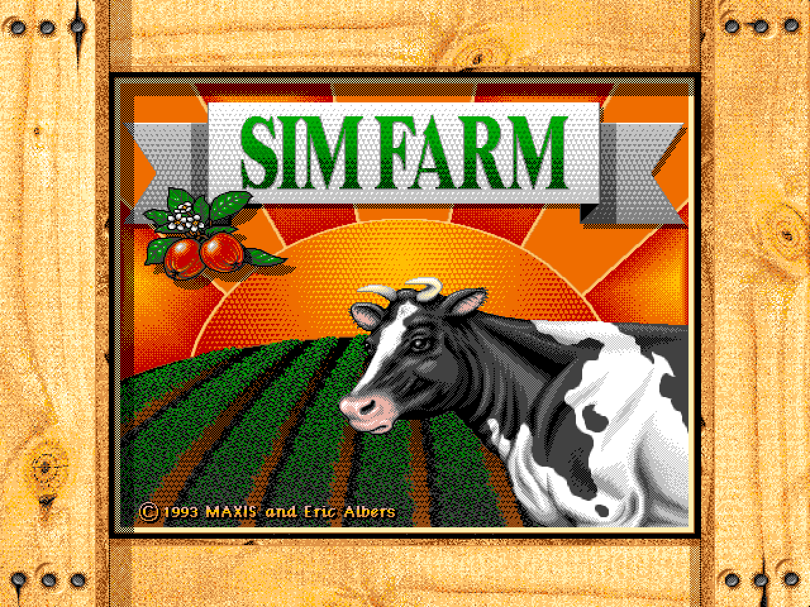
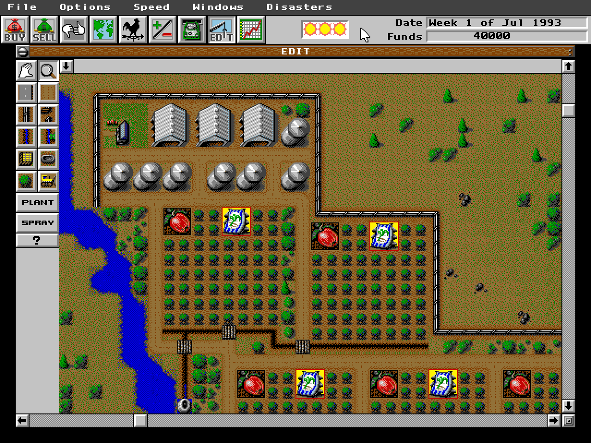
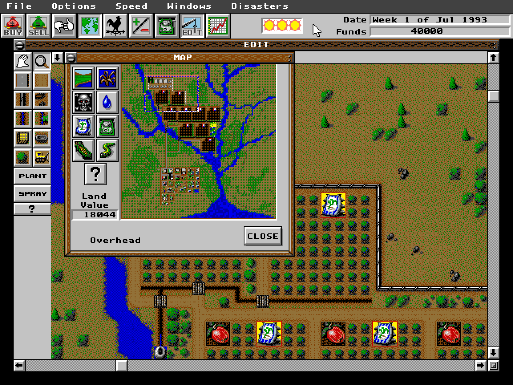
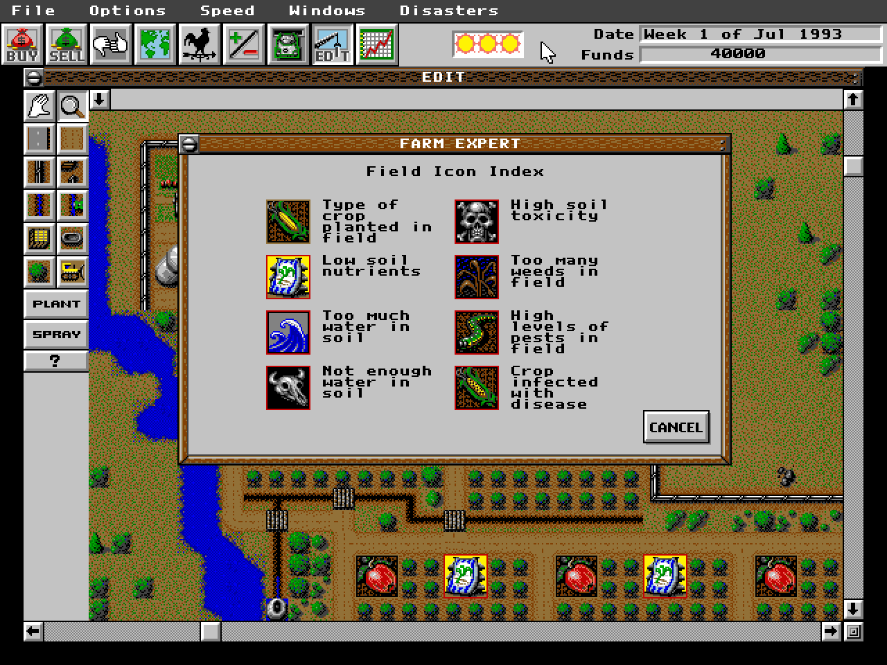
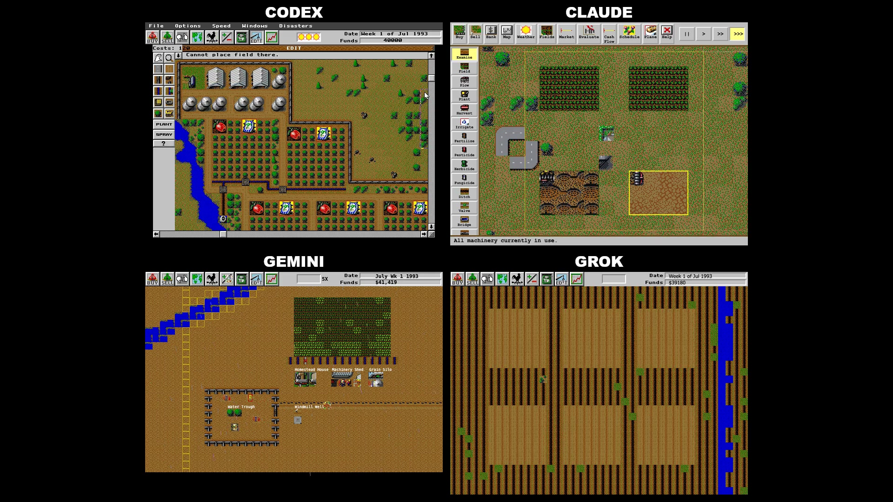

# SimFarm V0 — the Codex reconstruction

A playable JavaScript reconstruction of the 1993 farming simulation, built with Codex as part of [World Engine](https://worldengine.space). Grow crops, raise livestock, buy machinery, manage the farm's finances, and contend with changing weather and disasters—all in a browser, with the original 640 × 480 presentation.

This is the **Codex version** from the four-model SimFarm experiment. The game runs directly on HTML Canvas; it does not run a DOS emulator.

[World Engine](https://worldengine.space) · [Twitter / X](https://x.com/worldenginespc) · [LinkedIn](https://www.linkedin.com/company/world-engine-space)

## Run locally

With **Node.js 22 or newer**:

```sh
git clone https://github.com/worldengine-space/SimFarm_V0.git
cd SimFarm_V0
npm start
```

Open **http://localhost:8000**. The built game is included, so playing does not require installing dependencies or compiling anything. You can also serve this directory with `python3 -m http.server 8000`.

### First steps

1. Click through the opening screens, select a region, and start a farm.
2. Use **Windows → Edit** for farm tools and **Windows → Buy** for supplies, equipment, buildings, and livestock.
3. Open **Windows → Farm Expert** for the in-game farming guide, or **Windows → Map** to inspect land and field conditions.
4. Change the simulation speed—or pause it—from the **Speed** menu.
5. Use **File → Save / Save As** to download your farm. **File → Load Game** imports `.SFM` and `.SSM` saves.

The interface follows the original mouse controls, including press-and-drag tool menus and some hold-to-view help controls. Click the game to give it keyboard focus and enable browser audio.

## Screenshots

### On the farm



### A view of the land



### The farming guide



These are captures of this browser build, enlarged to twice its native resolution.

## Four models, one SimFarm

[](https://worldengine.space/media/simfarm-four-models.mp4)

**[Watch the comparison video](https://worldengine.space/media/simfarm-four-models.mp4)** — 42 seconds of the Codex, Claude, Gemini, and Grok reconstructions running side by side. More experiments at [worldengine.space](https://worldengine.space/#work).

## Working on the code

```sh
npm install
npm run build
npm test
```

Edit the source files in `src/`, then run `npm run build` to regenerate `game.js`. The source is divided into ordered, readable sections that share a private game scope, preserving the existing simulation and save behavior. `game.js` is the generated browser entry point.

Use `npm run format` to format the code and `npm run format:check` to check formatting.

See the [code guide](docs/CODE_GUIDE.md) for a map of the source and notes on the simulation's structure.

| Path | Purpose |
| --- | --- |
| `index.html`, `styles.css` | Browser page and canvas layout |
| `src/` | Game source, organized by responsibility |
| `game.js` | Generated runtime, ready to serve |
| `assets/`, `data/` | Graphics, sound, scenarios, and decoded game data |
| `tests/` | Portable regression checks |
| `docs/` | Project documentation and screenshots |

### Status

V0 is a research reconstruction. It includes the farm simulation, original-style menus and reports, regional starting farms, crop schedules, machinery, livestock, weather, disasters, music, sound, and native-format save support. Regression checks cover specific behaviors; they do not establish perfect parity for every possible play sequence.

## Credits

Created by [Lukas Tencer](https://lukastencer.com/) with Codex for [World Engine](https://worldengine.space).

SimFarm was created by Maxis. Original game names, artwork, audio, and other original materials belong to their respective owners. This is an independent reconstruction project.
